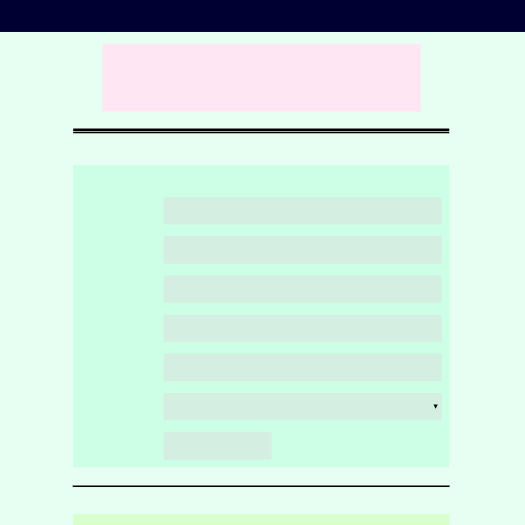

# treehouse-frontend-project03
TreeHouse FrontEnd Project 3 - An online registration form

[Click here](https://canpu.github.io/treehouse-frontend-project03/) to view the demo

## Brief Introduction

* This webpage is an registration form.
* The webpage adopts a mobile first responsive design.
* The first part of the registration form is contact information, including name, email, phone and address.
* The second part is newsletter subscription. The user can choose whether or not to receive HTML, CSS and JavaScript news, and can choose to receive HTML formatted or plain text news. The user can enter unlisted interesting topics in the text area.

## Techniques Involed

* HTML
* CSS
* JavaScript
* jQuery

